<!-- you weren't supposed to inspect this -->

<div align="center">
  
</div>

<p align="left">
  <picture>
    <source media="(prefers-color-scheme: dark)" srcset="https://raw.githubusercontent.com/Nortaq-PlayNexus/Nortaq-PlayNexus/main/assets/hero.svg">
    <source media="(prefers-color-scheme: light)" srcset="https://raw.githubusercontent.com/Nortaq-PlayNexus/Nortaq-PlayNexus/main/assets/hero-static.svg">
    
  </picture>
  <em><code>// decorative readout: not a factual claim</code></em>
</p>

<p align="center">
  <a href="https://github.com/Nortaq-PlayNexus?tab=repositories"></a>
  
  
  
</p>

<p align="center">
  <a href="https://nortaq-playnexus.github.io/Nortaq-PlayNexus/mission-control"></a>
  <a href="https://nortaq-playnexus.github.io/nasa-investigation/"></a>
  <a href="https://github.com/Nortaq-PlayNexus/aurora-audio-engine"></a>
  <a href="https://github.com/Nortaq-PlayNexus/FreeStack"></a>
</p>

---

## PHANTOMTAPE OS v7.4

```
PHANTOMTAPE OS v7.4
──────────────────────────────────────

BOOT SEQUENCE
[████████████████████████] 100%

KERNEL ............... ONLINE
AUDIO BUS ............ ONLINE
AI CORTEX ............ ONLINE
REPOSITORY MESH ...... ONLINE
TELEMETRY ............ ONLINE
SIGNAL ............... LOCKED

> type "help" to continue
```

```
> help

IDENTITY       <kbd>#identity</kbd>
PROJECTS       <kbd>#workshop</kbd>
TELEMETRY      <kbd>#signal</kbd>
ARCHIVE        <kbd>#archive</kbd>
CONSTELLATION  <kbd>#constellation</kbd>
NETWORK        <kbd>#frequencies</kbd>
AUDIO          <kbd>#transmission</kbd>
VERIFY         <kbd>#verify</kbd>
MISSION CTRL   <kbd>Ctrl+Click</kbd> → https://nortaq-playnexus.github.io/Nortaq-PlayNexus/mission-control

PRESS <kbd>?</kbd> ON ANY GITHUB PAGE FOR SHORTCUTS
PRESS <kbd>.</kbd> ON ANY REPO TO OPEN IN VS CODE
PRESS <kbd>T</kbd> TO FUZZY-FIND FILES
PRESS <kbd>Y</kbd> FOR PERMALINK
```

---

## // 01 :: IDENTITY

<a name="identity"></a>

`$ whoami`

**DJ PHANTOMTAPE** — I build autonomous systems that make, analyze, and move sound: AI DJ mixing engines, DSP audio routing, music-publishing pipelines, and the local AI infrastructure that powers them. Everything runs local-first, offline where it can, and slightly too ambitious everywhere else.

<pre>
IDENT ......... PHANTOMTAPE
ROLE .......... DJ / BUILDER / EXPERIMENTER
CURRENT MODE .. CREATING
INTERESTS ..... AUDIO / SOFTWARE / AUTOMATION / WEIRD PROJECTS
LANGUAGES ..... PYTHON · JAVASCRIPT · TYPESCRIPT · RUST · C# · HTML · PHP
TOOLS ......... WEB AUDIO · WASAPI DSP · OLLAMA · TAURI · OPENCV/YOLO · THREE.JS · GITHUB ACTIONS
LOCATION ...... <PHANTOMTAPE_P-03 UNKNOWN: TUNED TO PLANET EARTH>
</pre>

---

<a name="transmission"></a>

## // 02 :: CURRENT TRANSMISSION

<p align="center">
  
</p>

```
┌──────────────────────────────────────┐
│ ● ON AIR                             │
│         NOW TRANSMITTING             │
│  SOURCE : SYNTHESIS — AI DJ ENGINE   │
│  MODE   : AUTONOMOUS MIX             │
│  DNA    : BEAT + KEY + ENERGY + CROWD│
│  LINK   : /synthesis-dj              │
│   ━━━━━━━━━━━━━○────────────         │
└──────────────────────────────────────┘
```

The `CURRENT TRANSMISSION` is real: **SYNTHESIS** compiles every track into a compact *Music DNA* fingerprint (tempo, key, energy, structure), then an in-browser AI Transition Director decides when and how to move between decks — fully offline. No cloud, no tracking. `// live music streaming integration pending (<PHANTOMTAPE_P-09>)`

---

<a name="archive"></a>

## // 03 :: PHANTOMTAPE ARCHIVE

`$ ls archive/`

Classified records from the music-engineering side of the room. SKUs are real projects, not tracks.

| SKU | TITLE | TYPE | STATUS | LINK |
|---|---|---|---|---|
| `PHNT-002` | SONIC FACILITY | music analysis, artifact, publishing pipeline | ◆ SHIPPED (exe available) | `/sonic-facility` |
| `PHNT-003` | MUSICVIDFORGE | beat-synced music video generator | ◆ SHIPPED | `/playnexus-musicvidforge` |
| `PHNT-004` | BRAINARR | local AI music discovery for Lidarr | ◐ IN DEVELOPMENT | `/Brainarr` |
| `PHNT-005` | RUST VOICE BOOSTER | pro DJ audio suite + virtual cable | ⚠ EXPERIMENTAL | `/RustVoiceBooster` |
| `PHNT-006` | FESTIVAL AUDIO POLISHER | beatgrid mashup pipeline: analyze → arrange → build → validate | ◆ SHIPPED | `/dj-festival-audio-polisher` |

`// full discography on external platforms pending <PHANTOMTAPE_P-09>`

---

<p align="center">
  
  <em><code>// decorative waveform</code></em>
</p>

---

<a name="workshop"></a>

## // 04 :: THE WORKSHOP

`$ cat workshop/manifest.txt` — REAL SOFTWARE, NO FICTION. Statuses reflect actual repo activity.

```
┌─ PROJECT // 001 ──── ● ONLINE ──────────────────────────────┐
│  SYNTHESIS-DJ                                                │
│  military-grade autonomous music intelligence platform.      │
│  beat/key/energy detection, Music DNA, AI Transition Director│
│  STACK: JavaScript · Electron · Web Audio                    │
│  [ SOURCE ] https://github.com/Nortaq-PlayNexus/synthesis-dj │
└──────────────────────────────────────────────────────────────┘
```

| # | PROJECT | ONE-LINE TRUTH | STACK | STATUS |
|---|---|---|---|---|
| 001 | [synthesis-dj](https://github.com/Nortaq-PlayNexus/synthesis-dj) | offline AI DJ engine that fingerprints tracks as *Music DNA* and mixes them autonomously | JS · Electron · Web Audio · Ollama | ● ONLINE |
| 002 | [FreeStack](https://github.com/Nortaq-PlayNexus/FreeStack) | runnable catalog of ~150 free services — $0/month infra (Cloudflare, Oracle VMs, LLM failover, R2) | Python | ◐ IN DEVELOPMENT |
| 003 | [nexus-agent-x](https://github.com/Nortaq-PlayNexus/nexus-agent-x) | local autonomous AI OS — Ollama cortex, memory, civilization. offline-first | Python | ● ACTIVE |
| 004 | [aurora-audio-engine](https://github.com/Nortaq-PlayNexus/aurora-audio-engine) | ultra-low-latency virtual audio routing/mixing for Windows (WASAPI + DSP) | Rust | ⚠ EXPERIMENTAL |
| 005 | [orion-sentinel-ai](https://github.com/Nortaq-PlayNexus/orion-sentinel-ai) | cinematic 3D Earth observation platform + simulated multi-agent anomaly detection | React 19 · Three.js | ◐ IN DEVELOPMENT |
| 006 | [PlayNexus-Foundry](https://github.com/Nortaq-PlayNexus/PlayNexus-Foundry) | web-based server command + config forge for game servers | TypeScript | ◐ IN DEVELOPMENT |
| 007 | [dj-festival-audio-polisher](https://github.com/Nortaq-PlayNexus/dj-festival-audio-polisher) | festival mashup pipeline on one shared beat grid — the tool behind the N×WAA bootleg | Python · librosa · scipy | ◆ SHIPPED |
| 008 | [heart](https://github.com/Nortaq-PlayNexus/heart) | H.E.A.R.T. — AI emotional cognition: perception, appraisal, episodic memory, response | Python | ◆ SHIPPED |
| 009 | [promoforge](https://github.com/Nortaq-PlayNexus/promoforge) | turn a local codebase into a launch strategy — scan, PKB, playbook, LLM content | Tauri · Rust · React | ◆ SHIPPED |
| 010 | [earth-globe](https://github.com/Nortaq-PlayNexus/earth-globe) | tiny interactive 3D Earth globe — pygame + PyOpenGL, offline, no external APIs | Python · pygame · PyOpenGL | ◆ SHIPPED |

`// complete living inventory in docs/projects.md`

---

<a name="toolbox"></a>

## // 05 :: TOOLBOX

`$ cat toolbox/`

Only what's actually in the repos. Nothing here is aspirational.

```text
AUDIO   : WEB AUDIO · WASAPI DSP · BEAT/KEY DETECTION · CAMELOT WHEEL · VIRTUAL AUDIO CABLE
CODE    : PYTHON(23) · RUST(4) · JAVASCRIPT(3) · TYPESCRIPT(3) · C#(2) · HTML(1) · PHP(1)
TOOLS   : GITHUB ACTIONS · TAURI · OLLAMA · LM STUDIO · OPENCV/YOLO · THREE.JS · ELECTRON
SYSTEMS : WINDOWS (WASAPI/TPM) · LINUX · CROSS-PLATFORM · LOCAL-FIRST
```

---

<a name="constellation"></a>

## // 06 :: REPOSITORY CONSTELLATION

`$ phantomtape --map`

Live architecture map of the entire PHANTOMTAPE NETWORK. Every node is a real repository. Activity dots: green = active this week, yellow = this month, grey = dormant.

<p align="center">
  
  <em><code>generated nightly by scripts/generate_assets.py from live GitHub API data</code></em>
</p>

### ARCHITECTURE MAP

```mermaid
graph TB
    CORE["◉ CORE<br/>Nortaq-PlayNexus"]
    CORE --> AUDIO["~ AUDIO<br/>9 repos"]
    CORE --> AI["@ AI<br/>14 repos"]
    CORE --> SYS["# SYSTEMS<br/>7 repos"]
    CORE --> EARTH["* EARTH<br/>4 repos"]
    CORE --> GAME["x GAMING<br/>3 repos"]
    CORE --> DATA["+ DATA<br/>4 repos"]

    AUDIO --> SYNTH["synthesis-dj<br/>JS | ● ONLINE"]
    AUDIO --> AURORA["aurora-audio-engine<br/>Rust | ⚠ EXPERIMENTAL"]
    AUDIO --> SONIC["sonic-facility<br/>Python | ◆ SHIPPED"]
    AUDIO --> DJ["dj-festival-audio-polisher<br/>Python | ◆ SHIPPED"]

    AI --> NEXUS["nexus-agent-x<br/>Python | ● ACTIVE"]
    AI --> HEART["heart<br/>Python | ◆ SHIPPED"]
    AI --> SWARM["swarmforge<br/>Python | ● ACTIVE"]
    AI --> SENT["sentinel<br/>Python | ● ACTIVE"]

    SYS --> FORGE["forge<br/>Python | ● ACTIVE"]
    SYS --> FOUNDRY["PlayNexus-Foundry<br/>TS | ◐ DEV"]
    SYS --> SECURE["SecureVault<br/>C# | ● ACTIVE"]

    EARTH --> ORION["orion-sentinel-ai<br/>JS | ◐ DEV"]
    EARTH --> NASA["nasa-investigation<br/>HTML | ◆ SHIPPED"]

    GAME --> ARK["ArkNexusX<br/>Rust | ● ACTIVE"]
    GAME --> TERROR["TerrorFibercraft<br/>Python | ● ACTIVE"]

    style CORE fill:#B8FF1E,stroke:#0a0e1a,color:#0a0e1a
    style AUDIO fill:#FF3B3B,stroke:#0a0e1a,color:#fff
    style AI fill:#B8FF1E,stroke:#0a0e1a,color:#0a0e1a
    style SYS fill:#00E5FF,stroke:#0a0e1a,color:#0a0e1a
    style EARTH fill:#FFC430,stroke:#0a0e1a,color:#0a0e1a
    style GAME fill:#FF4D00,stroke:#0a0e1a,color:#fff
    style DATA fill:#9B59B6,stroke:#0a0e1a,color:#fff
```



---

<a name="signal"></a>

## // 07 :: SIGNAL ACTIVITY

Every commit is a transmission. The visualizations below are your contribution graph, recolored and re-rendered nightly from real data.

<p align="center">
  
  <em><code>snake via Platane/snk -- generated daily at 00:00 UTC</code></em>
</p>

<p align="center">
  
  <em><code>CRT equalizer generated by scripts/crt_equalizer.py</code></em>
</p>


The real-time 53-week signal strip, system metrics, the verifiable **SIGNAL HASH**, and the personality panel all live in the region below — rebuilt nightly by `.github/workflows/rebroadcast.yml`, so the broadcast is always current.

<!-- REBROADCAST:BEGIN -->

```text
┌─ TRANSMISSION STATUS ─────────────────────────────┐
│ GITHUB ........... ONLINE      REPOS .............   53 │
│ CONTRIBUTIONS ..... 987     FOLLOWERS ..........    2 │
│ UPLINK AGE ........   40 DAYS │
│ SIGNAL HASH ....... B489FA   SIGNAL ......... #######=........  42%  PHASE 02 │
└──────────────────────────────────────────────────────┘

// SIGNAL ACTIVITY -- REAL-TIME WEEK STRIP (LIVE DATA)
   00                            10                            20                            30                            40                            50    52
   ..............................................==#-###
   LOW ───────────────────────────────────────────── HIGH

// SYSTEM METRICS -- SNAPSHOT (AUDITABLE)
CONTRIBUTIONS ...... 987
REPOSITORIES ....... 53
FOLLOWERS .......... 2
COLLECTED STARS .... 9
BROADCASTING FOR ... 40 DAYS (SINCE 2026-07-31 UTC)

// RECENT CATCHES -- LAST 3 PUSHES
  Nortaq-PlayNexus             PUSHED 2026-09-09
  playnexus-sovereign-meta-agent PUSHED 2026-09-07
  archive-07                   PUSHED 2026-09-07

// BROADCAST SCHEDULE -- REAL WORKFLOW CRONS
  SNAKE TRANSMITTER [daily] -> .github/workflows/snake.yml
  REBROADCAST       [nightly] -> .github/workflows/rebroadcast.yml
  ASSET GENERATOR   [nightly] -> scripts/generate_assets.py

// SYSTEM STATUS
GITHUB ........ ONLINE
PROJECTS ...... ACTIVE
AUDIO ......... ONLINE
BRAIN ......... QUESTIONABLE
COFFEE ........ REQUIRED

```

<details>
  <summary><code>CASES:// RAW ARCHIVE INDEX -- 53 FILES</code></summary>

```text
  Nortaq-PlayNexus                 TypeScript   *0
  playnexus-sovereign-meta-agent   Python       *0
  archive-07                       -            *0
  TerrorFibercraft-Admin           Python       *0
  phantom                          Python       *0
  earth-globe                      Python       *0
  ProjectPhoenix                   C#           *0
  dj-festival-audio-polisher       Python       *0
  playnexus-musicvidforge          Python       *0
  ArkNexusX                        Rust         *0
  sonic-facility                   Python       *1
  osmp                             TypeScript   *0
  cto                              Python       *0
  military-anomaly-scanner         Python       *0
  aether-facility                  Python       *1
  neuralforge                      Python       *0
  archon                           Python       *0
  PlayNexus-Foundry                TypeScript   *0
  sentinel                         Python       *0
  SecureVault                      C#           *0
  swarmforge                       Python       *0
  nexus-agent-x                    Python       *0
  forge                            Python       *0
  orion-sentinel-ai                JavaScript   *1
  synthesis-dj                     JavaScript   *0
  heart                            Python       *0
  promoforge                       Rust         *0
  FreeStack                        Python       *1
  nasa-investigation               HTML         *2
  aurora-audio-engine              Rust         *1
  color_quant                      -            *0
  envoy-proxy-crowdsec-bouncer     Go           *0
  better_bing_image_downloader     Python       *0
  agency-swarm                     Python       *0
  ark-arena-architect              TypeScript   *0
  sqlalchemy-history               Python       *0
  register                         JavaScript   *0
  hexstrike-ai                     Python       *0
  Scaffold                         PHP          *0
  Brainarr                         C#           *0
  recovar                          Python       *1
  web-widgets                      TypeScript   *0
  meteofrance-api                  -            *0
  fusil                            Python       *0
  pdb-addr2line                    -            *0
  myskoda                          Python       *0
  terrorfibercraftark              HTML         *0
  resourcegather                   Python       *0
  Starminder                       Python       *0
  RustVoiceBooster                 JavaScript   *0
  cookiecutter-wagtail-vix         -            *0
  python-hid-parser                -            *1
  pygeofilter                      -            *0
```
</details>

<sup>LAST REBROADCAST 20260909 UTC . data source: GRAPHQL . hash salt public in docs/how-to-verify.md</sup>

<!-- REBROADCAST:END -->

---

<a name="assets"></a>

## // 08 :: LIVE ASSETS

All generated nightly from real GitHub API data by `scripts/generate_assets.py`. Every number below is auditable.

<!-- ASSETS:BEGIN -->

```
╔══════════════════════════════════════╗
║       PHANTOMTAPE SIGNAL WEATHER     ║
╠══════════════════════════════════════╣
║                                      ║
║  ACTIVITY       ███████░░░░░   65%    ║
║  MOMENTUM       ████████████  100%    ║
║  BUILD PRESSURE ████████████  100%    ║
║  CHAOS INDEX    ████████████  100%    ║
║                                      ║
║  FORECAST                             ║
  [~] MULTIPLE SYSTEMS IN DEVELOPMENT
  [*] CHAOS INDEX ELEVATED
  [+] BUILD PRESSURE INCREASING
╚══════════════════════════════════════╝
```

```
PHANTOMTAPE TECHNOLOGY GENOME

Python         ████████████████████  27
TypeScript     ███░░░░░░░░░░░░░░░░░  5
JavaScript     ██░░░░░░░░░░░░░░░░░░  4
C#             ██░░░░░░░░░░░░░░░░░░  3
Rust           ██░░░░░░░░░░░░░░░░░░  3
HTML           █░░░░░░░░░░░░░░░░░░░  2
Go             ░░░░░░░░░░░░░░░░░░░░  1
PHP            ░░░░░░░░░░░░░░░░░░░░  1

DOMAIN GENOME

AI             ████████████████████  14
AUDIO          ████████████░░░░░░░░  9
LANG           ███████████░░░░░░░░░  8
SYSTEMS        ██████████░░░░░░░░░░  7
EARTH          █████░░░░░░░░░░░░░░░  4
DATA           █████░░░░░░░░░░░░░░░  4
GAMING         ████░░░░░░░░░░░░░░░░  3
OTHER          ██░░░░░░░░░░░░░░░░░░  2
WEB            ██░░░░░░░░░░░░░░░░░░  2
```

```
╭──────────────────────────────────────────╮
│ ◉ NASA-INVESTIGATION                    │
│                                          │
│ Exclusive anomaly detection pipeline for NASA HiRISE│
│                                          │
│ ANOMALY-DETECTION · GITHUB-PAGES · HIROSE · IMAGE-ANALYSIS│
│                                          │
│ STARS  2     FORKS  0     ISSUES 0   │
│ STATUS ████████░░  88%     │
│ MATURITY █████░░░░░            │
│                                          │
│ [https://github.com/Nortaq-PlayNexus/nasa-investigation]                        │
╰──────────────────────────────────────────╯
```

```
╭──────────────────────────────────────────╮
│ ◉ SONIC-FACILITY                        │
│                                          │
│ Music organization, analysis, imagery & publishing f│
│                                          │
│ AI-ART · AUDIO-ANALYSIS · BPM-DETECTION · MUSIC│
│                                          │
│ STARS  1     FORKS  0     ISSUES 0   │
│ STATUS █████████░  94%     │
│ MATURITY ███░░░░░░░            │
│                                          │
│ [https://github.com/Nortaq-PlayNexus/sonic-facility]                        │
╰──────────────────────────────────────────╯
```

```
╭──────────────────────────────────────────╮
│ ◉ AETHER-FACILITY                       │
│                                          │
│ Military-grade research scaffold for collecting, ver│
│                                          │
│ DATA-COLLECTION · FORENSICS · INVESTIGATION · RESEARCH│
│                                          │
│ STARS  1     FORKS  0     ISSUES 0   │
│ STATUS █████████░  94%     │
│ MATURITY ███░░░░░░░            │
│                                          │
│ [https://github.com/Nortaq-PlayNexus/aether-facility]                        │
╰──────────────────────────────────────────╯
```

```
╭──────────────────────────────────────────╮
│ ◉ ORION-SENTINEL-AI                     │
│                                          │
│ Enterprise-grade planetary intelligence platform - c│
│                                          │
│ ANOMALY-DETECTION · COMMAND-CENTER · DATA-VISUALIZATION · EARTH-OBSERVATION│
│                                          │
│ STARS  1     FORKS  0     ISSUES 10  │
│ STATUS ████████░░  88%     │
│ MATURITY ███░░░░░░░            │
│                                          │
│ [https://github.com/Nortaq-PlayNexus/orion-sentinel-ai]                        │
╰──────────────────────────────────────────╯
```

```
╭──────────────────────────────────────────╮
│ ◉ FREESTACK                             │
│                                          │
│ Run websites, MCP servers, SSH tunnels, APIs, databa│
│                                          │
│ AUTOMATION · CLOUDFLARE-WORKERS · DEVOPS · FREE-STACK│
│                                          │
│ STARS  1     FORKS  0     ISSUES 0   │
│ STATUS ████████░░  88%     │
│ MATURITY ███░░░░░░░            │
│                                          │
│ [https://github.com/Nortaq-PlayNexus/FreeStack]                        │
╰──────────────────────────────────────────╯
```

```
╭──────────────────────────────────────────╮
│ ◉ AURORA-AUDIO-ENGINE                   │
│                                          │
│ AURORA Audio Engine - ultra-low-latency virtual audi│
│                                          │
│ AUDIO-ENGINE · AUDIO-PROCESSING · DSP · MUSIC-TECHNOLOGY│
│                                          │
│ STARS  1     FORKS  0     ISSUES 6   │
│ STATUS ████████░░  88%     │
│ MATURITY ███░░░░░░░            │
│                                          │
│ [https://github.com/Nortaq-PlayNexus/aurora-audio-engine]                        │
╰──────────────────────────────────────────╯
```

```text
PHANTOMTAPE // NIGHTLY INTELLIGENCE REPORT
20260909

NEW REPOSITORIES ........ 53
CONTRIBUTIONS (YR) ...... 987
REPOSITORIES ............ 53
LANGUAGES ............... 8
TOTAL STARS ............. 9

MOST ACTIVE (7 DAYS):
  01 Nortaq-PlayNexus               0d ago
  02 playnexus-sovereign-meta-agent 1d ago
  03 archive-07                     1d ago
  04 TerrorFibercraft-Admin         1d ago
  05 phantom                        1d ago

SIGNAL WEATHER:
  ACTIVITY       ███████░░░░░  65%
  CHAOS INDEX    ████████████  100%

ANOMALIES:
  [!] pygeofilter -- no activity for 38 days

FORECAST:
  HIGH development activity
  50 repositories active in last 14 days

```

```
╔════════════════════════════════╗
║       SYSTEM INTEGRITY         ║
╠════════════════════════════════╣
║                                ║
║ CI/CD .............. ● PASS    ║
║ TESTS .............. ● PASS    ║
║ SECURITY ........... ● PASS    ║
║ DEPENDENCIES ........● PASS    ║
║ BUILD ...............● PASS    ║
║ DOCUMENTATION .......● PASS    ║
║                                ║
║ LAST AUDIT          20260909  ║
╚════════════════════════════════╝
```

╭────────────────────────────────╮
│ CURRENT OBSESSION              │
├────────────────────────────────┤
│
│  Python                        │
│  TypeScript                    │
│  JavaScript                    │
│  C#                            │
│  Rust                          │
│  #python                       │
│  #ai                           │
│  #rust                         │
│
│ STATUS: OBSESSED               │
╰────────────────────────────────╯

```
  2026 ───── C#, Go, HTML, JavaScript, PHP, Python, Rust, TypeScript
             │
             ▼
        CURRENT STACK
```

```text
WHILE YOU WERE AWAY...

  +33 repositories modified
  +987 contributions (rolling year)
  +53 new experiments this year
  +53 total transmissions

  The machine did not sleep.
```

```text
PROJECT LIFECYCLE

  PROTOTYPE (3)
    ├─ cookiecutter-wagtail-vix
    ├─ python-hid-parser
    ├─ pygeofilter

  ACTIVE (50)
    ├─ Nortaq-PlayNexus
    ├─ playnexus-sovereign-meta-agent
    ├─ archive-07
    ├─ TerrorFibercraft-Admin
    ├─ phantom
    └─ ... +45 more

```

<!-- ASSETS:END -->

---

<a name="dna"></a>

## // 09 :: REPOSITORY DNA

`$ phantomtape --dna`

Auto-generated DNA cards for the top repositories. Status bars reflect real activity metrics.

<!-- DNA_CARDS:BEGIN -->

```
╭──────────────────────────────────────────╮
│ ◉ NASA-INVESTIGATION                    │
│                                          │
│ Exclusive anomaly detection pipeline for NASA HiRISE│
│                                          │
│ ANOMALY-DETECTION · GITHUB-PAGES · HIROSE · IMAGE-ANALYSIS│
│                                          │
│ STARS  2     FORKS  0     ISSUES 0   │
│ STATUS █████████░  97%     │
│ MATURITY █████░░░░░            │
│                                          │
│ [https://github.com/Nortaq-PlayNexus/nasa-investigation]                        │
╰──────────────────────────────────────────╯
```

```
╭──────────────────────────────────────────╮
│ ◉ ORION-SENTINEL-AI                     │
│                                          │
│ Enterprise-grade planetary intelligence platform - c│
│                                          │
│ ANOMALY-DETECTION · COMMAND-CENTER · DATA-VISUALIZATION · EARTH-OBSERVATION│
│                                          │
│ STARS  1     FORKS  0     ISSUES 10  │
│ STATUS █████████░  97%     │
│ MATURITY ███░░░░░░░            │
│                                          │
│ [https://github.com/Nortaq-PlayNexus/orion-sentinel-ai]                        │
╰──────────────────────────────────────────╯
```

```
╭──────────────────────────────────────────╮
│ ◉ FREESTACK                             │
│                                          │
│ Run websites, MCP servers, SSH tunnels, APIs, databa│
│                                          │
│ AUTOMATION · CLOUDFLARE-WORKERS · DEVOPS · FREE-STACK│
│                                          │
│ STARS  1     FORKS  0     ISSUES 0   │
│ STATUS █████████░  97%     │
│ MATURITY ███░░░░░░░            │
│                                          │
│ [https://github.com/Nortaq-PlayNexus/FreeStack]                        │
╰──────────────────────────────────────────╯
```

```
╭──────────────────────────────────────────╮
│ ◉ AURORA-AUDIO-ENGINE                   │
│                                          │
│ AURORA Audio Engine - ultra-low-latency virtual audi│
│                                          │
│ AUDIO-ENGINE · AUDIO-PROCESSING · DSP · MUSIC-TECHNOLOGY│
│                                          │
│ STARS  1     FORKS  0     ISSUES 6   │
│ STATUS █████████░  97%     │
│ MATURITY ███░░░░░░░            │
│                                          │
│ [https://github.com/Nortaq-PlayNexus/aurora-audio-engine]                        │
╰──────────────────────────────────────────╯
```

```
╭──────────────────────────────────────────╮
│ ◉ RECOVAR                               │
│                                          │
│ Fork of ma-gilles/recovar - an end-to-end cryo-EM re│
│                                          │
│ BIOINFORMATICS · CRYO-EM · PYTHON · SINGLE-PARTICLE-ANALYSIS│
│                                          │
│ STARS  1     FORKS  0     ISSUES 0   │
│ STATUS █████████░  94%     │
│ MATURITY ███░░░░░░░            │
│                                          │
│ [https://github.com/Nortaq-PlayNexus/recovar]                        │
╰──────────────────────────────────────────╯
```

```
╭──────────────────────────────────────────╮
│ ◉ AETHER-FACILITY                       │
│                                          │
│ Military-grade research scaffold for collecting, ver│
│                                          │
│ DATA-COLLECTION · FORENSICS · INVESTIGATION · RESEARCH│
│                                          │
│ STARS  1     FORKS  0     ISSUES 0   │
│ STATUS ███████░░░  70%     │
│ MATURITY ███░░░░░░░            │
│                                          │
│ [https://github.com/Nortaq-PlayNexus/aether-facility]                        │
╰──────────────────────────────────────────╯
```

<!-- DNA_CARDS:END -->

---

<a name="weather"></a>

## // 10 :: SIGNAL WEATHER

`$ phantomtape --weather`

Activity metrics computed from actual GitHub data. Updated nightly.

<!-- WEATHER:BEGIN -->

```
╔══════════════════════════════════════╗
║       PHANTOMTAPE SIGNAL WEATHER     ║
╠══════════════════════════════════════╣
║                                      ║
║  ACTIVITY       █░░░░░░░░░░░   10%    ║
║  MOMENTUM       ████████████  100%    ║
║  BUILD PRESSURE ████████████  100%    ║
║  CHAOS INDEX    ██░░░░░░░░░░   20%    ║
║                                      ║
║  FORECAST                             ║
  [~] MULTIPLE SYSTEMS IN DEVELOPMENT
  [+] BUILD PRESSURE INCREASING
╚══════════════════════════════════════╝
```

<!-- WEATHER:END -->

---

<a name="intel"></a>

## // 11 :: NIGHTLY INTELLIGENCE REPORT

`$ phantomtape --intel`

Generated every night from live data. The machine watches itself.

<!-- INTEL:BEGIN -->

```text
PHANTOMTAPE // NIGHTLY INTELLIGENCE REPORT
20260906

NEW REPOSITORIES ........ 53
CONTRIBUTIONS (YR) ...... 0
REPOSITORIES ............ 53
LANGUAGES ............... 8
TOTAL STARS ............. 9

MOST ACTIVE (7 DAYS):
  01 Nortaq-PlayNexus               0d ago
  02 orion-sentinel-ai              1d ago
  03 synthesis-dj                   1d ago
  04 heart                          1d ago
  05 FreeStack                      1d ago

SIGNAL WEATHER:
  ACTIVITY       █░░░░░░░░░░░  10%
  CHAOS INDEX    ██░░░░░░░░░░  20%

ANOMALIES:
  [!] pygeofilter -- no activity for 35 days

FORECAST:
  MODERATE development activity
  49 repositories active in last 14 days

```

<!-- INTEL:END -->

---

<a name="integrity"></a>

## // 12 :: SYSTEM INTEGRITY

`$ phantomtape --verify`

<!-- INTEGRITY:BEGIN -->

```
╔════════════════════════════════╗
║       SYSTEM INTEGRITY         ║
╠════════════════════════════════╣
║                                ║
║ CI/CD .............. ● PASS    ║
║ TESTS .............. ● PASS    ║
║ SECURITY ........... ● PASS    ║
║ DEPENDENCIES ........● PASS    ║
║ BUILD ...............● PASS    ║
║ DOCUMENTATION .......● PASS    ║
║                                ║
║ LAST AUDIT          20260906  ║
╚════════════════════════════════╝
```

<!-- INTEGRITY:END -->

---

<a name="obsession"></a>

## // 13 :: CURRENT OBSESSION

`$ phantomtape --obsess`

<!-- OBSESSION:BEGIN -->

```
╭────────────────────────────────╮
│ CURRENT OBSESSION              │
├────────────────────────────────┤
│                                │
│  Python                        │
│  JavaScript                    │
│  Rust                          │
│  TypeScript                    │
│                                │
│  #ai                           │
│  #audio                        │
│  #dsp                          │
│                                │
│ STATUS: OBSESSED               │
╰────────────────────────────────╯
```

<!-- OBSESSION:END -->

---

<a name="timeline"></a>

## // 14 :: LANGUAGE EVOLUTION

`$ phantomtape --timeline`

How the stack evolved over time:

<!-- TIMELINE:BEGIN -->

```text
  2026 ───── Python, JavaScript, TypeScript, Rust, C#, HTML, Go, PHP
             │
             ▼
        CURRENT STACK
```

<!-- TIMELINE:END -->

---

<a name="lifecycle"></a>

## // 15 :: PROJECT LIFECYCLE

`$ phantomtape --lifecycle`

<!-- LIFECYCLE:BEGIN -->

```text
PROJECT LIFECYCLE

  ACTIVE (19)
    ├─ orion-sentinel-ai
    ├─ synthesis-dj
    ├─ heart
    ├─ FreeStack
    ├─ Nortaq-PlayNexus
    └─ ... +14 more

  PROTOTYPE (18)
    ├─ promoforge
    ├─ nasa-investigation
    ├─ aurora-audio-engine
    ├─ better_bing_image_downloader
    ├─ recovar
    └─ ... +13 more

  MAINTENANCE (14)
    ├─ color_quant
    ├─ envoy-proxy-crowdsec-bouncer
    ├─ ProjectPhoenix
    ├─ agency-swarm
    ├─ osmp
    └─ ... +9 more

```

<!-- LIFECYCLE:END -->

---

<a name="away"></a>

## // 16 :: WHILE YOU WERE AWAY

<!-- WHILE_AWAY:BEGIN -->

```text
WHILE YOU WERE AWAY...

  +9 repositories modified
  +0 contributions (rolling year)
  +0 new experiments this year
  +53 total transmissions

  The machine did not sleep.
```

<!-- WHILE_AWAY:END -->

---

<a name="classified"></a>

## // 17 :: CLASSIFIED ARCHIVE

`ACCESS LEVEL: ████`

<details>
  <summary><code>[ OPEN FILE ]</code></summary>

```text
PHANTOMTAPE   ▄▄▄▄▄▄▄▄▄▄▄▄▄▄▄▄▄▄▄▄▄▄▄▄▄▄
ARCHIVE NODE 07 — INTERNAL LOG
────────────────────────────────────────
2026-07-31  node 07 came online
2026-08-13  B-sides pressed to tape
2026-08-29  signal acquired  (majority of
            life-time output burst here)
────────────────────────────────────────
```

`$ sudo open_secret`

```
you asked for it. the real secret is that
most "overnight successes" are just a
really good 34-day press run.
```

`$ decode 5bhPHAiN0zbXmTVlXAgNA`

```diff
+ THE CASSETTES ARE NOT THE PRODUCT. THE SIGNAL IS.
- (no, don't try to decode it by hand)
# plain text is right above this line
! this entire profile is a container for real work
```

`$ find / -name '*07*'`

```
/archive-07  →  https://github.com/Nortaq-PlayNexus/archive-07
clue trail: FREQ 103.7 → PHNT-001 → ARCHIVE NODE 07 → SIGNAL 07
```

**INTERNAL TRACK LIST** (B-sides, obviously fictional — no point pretending otherwise)

```text
A1  STATIC IN THE VOID         3:33
A2  LOOP · DETECT · REPEAT     4:04
A3  DEAD AIR IS DATA TOO       2:47
B1  WAVEFORM FROM A DEAD SUN   5:55
B2  LOW-CUT THE GOVERNMENT     3:17
B3  SIDE B IS THE FLOOR        1:07
```

```
ERROR 404: NORMAL PROFILE NOT FOUND
```
</details>

---

<a name="verify"></a>

## // 18 :: VERIFY SIGNAL

Every number in the transmission block is machine-stamped from the live GitHub API, and the `SIGNAL HASH` makes that provable:

```bash
# 1. read the four public numbers from today's block
# 2. local python, zero network:
python3 scripts/signal_hash.py Nortaq-PlayNexus <REPOS> <FOLLOWERS> <CONTRIB> <YYYYMMDD>
# 3. compare to SIGNAL HASH - if it matches, this page is real, not hand-painted
```

Full derivation: [`docs/how-to-verify.md`](docs/how-to-verify.md). The salt is public,
the inputs are public, and the profile still rehashes itself every night.

---

<a name="metrics"></a>

## // 19 :: TELEMETRY

<p align="center">
  
</p>

---

<a name="frequencies"></a>

## // 20 :: FREQUENCIES

```text
    FM DIAL ▒▒▒▒▒▒▒▒▒▒▒▒▒▒▒▒▒▒▒▒▒▒▒▒▒▒▒▒▒▒▒▒▒▒▒▒▒▒▒▒▒
       MHz  87.5 ────────────────────────────── 108
              ▲ broadcast band, tuned to 103.7 forever
```

```text
GITHUB ..... @Nortaq-PlayNexus ..... https://github.com/Nortaq-PlayNexus
DISCORD .... [ OFF AIR — <PHANTOMTAPE_P-10> ]
MUSIC ...... [ OFF AIR — <PHANTOMTAPE_P-10> ]
YOUTUBE .... [ OFF AIR — <PHANTOMTAPE_P-10> ]
INSTAGRAM .. [ OFF AIR — <PHANTOMTAPE_P-10> ]
WEBSITE .... [ OFF AIR — <PHANTOMTAPE_P-10> ]
```

`$ man phantomtape`

```text
NAME
    phantomtape - a github profile disguised as a pirate radio transmission

SYNOPSIS
    browse it.

DESCRIPTION
    Nearly everything you just read is staged. The projects are real, the
    numbers are real, the hashes are verifiable. The drama is a container.

OPTIONS
    --secret    there is no --secret. that would be a real secret.
    --listen    README.md section 03, PHNT-002
    --verify    python3 scripts/signal_hash.py (see docs/how-to-verify.md)

SEE ALSO
    archive/ (ARCHIVE NODE 07), about 41 other files upstairs
```

---

## // 21 :: MASHBOARD

<p align="center">
  <a href="https://nortaq-playnexus.github.io/Nortaq-PlayNexus/mission-control">
    
  </a>
</p>

<p align="center">
  <em><code>repository count · languages · commits · streak · stars · forks · issues · releases · project statuses · CI health · activity · signal weather</code></em>
</p>

---

## // MILESTONES

Real only.

```text
RT  broadcast started         2026-07-31 UTC
TX  forty-plus public transmissions (repositories — live count in block 01)
++  hundreds of contributions in the first broadcast year
GR  7 detected primary genomes, dominated by Python
LS  2 listeners locked in (live follower count in block 01)
```

---

## // 22 :: MANIFEST.TXT

```text
MAKE THINGS.
BREAK THINGS.
LEARN WHY.
MAKE THEM BETTER.
SHIP SOMETHING.
```

---

## // 23 :: HIDDEN LAYER

<details>
  <summary><code>[ CLASSIFIED: PRESS <kbd>.</kbd> ON ANY REPO FOR VS CODE ]</code></summary>

```text
you found the hidden layer.

things you can do that most people don't know:
  - press . on any repo → opens VS Code in browser
  - press t → fuzzy file finder
  - press y → permanent permalink
  - press ? → all keyboard shortcuts
  - add ?w=1 to any PR URL → hides whitespace changes
  - add .diff to any commit URL → raw diff
  - add .patch to any commit URL → raw patch
  - swap github.com → github1s.com → read-only VS Code
  - swap github.com → gitdiagram.com → visual repo diagram
  - swap github.com → gitingest.com → AI-ready text summary
  - visit api.github.com/zen → random zen quote
  - visit api.github.com/octocat → ASCII art
  - visit github.com/π → Pi to 336 decimal places

the profile itself is an ARG. there are 7 eggs.
you've probably found some of them already.
```

```text
PHANTOMTAPE // NODE 07

FREQUENCY: 103.7
SIGNAL: 07
KEY: ********

> YOU FOUND THE BACKDOOR
```
</details>

---

```
━━━━━━━━━━━━━━━━━━━━━━ ◉ ━━━━━━━━━━━━━━━━━━━━━━
END OF TRANSMISSION
PHANTOMTAPE // 2026
ARCHIVE NODE 07 // SIGNAL 07
SIGNAL LOST.
```

<p align="center">
  <a href="#identity">[ RECONNECT ▸ ]</a>
</p>

<!-- PHNT-OS: if you deciphered all seven eggs, whisper "103.7" to a friend within 24 hours. -->
<!-- ARG-NODE-07: the constellation has 9 domains. the genome has 8 languages. the signal has 6 hash chars. 9+8+6 = 23. the 23rd character of the README is... keep looking. -->
<!-- HINT-01: the DNA cards are ranked by stars + recency. the top card has 2 stars. -->
<!-- HINT-02: frequency 103.7 appears in the boot sequence, the dial, and the archive clue trail. -->
<!-- HINT-03: ARCHIVE NODE 07 = the 7th egg. find all 7 to unlock the backdoor. -->
<!-- HINT-04: the system integrity panel says LAST AUDIT is the rebroadcast date. -->
<!-- HINT-05: the signal hash is 6 hex chars. that's 24 bits of entropy. -->
<!-- HINT-06: the constellation SVG has a green dot for active repos, yellow for monthly. -->
<!-- HINT-07: the manifest says MAKE, BREAK, LEARN, BETTER, SHIP. five words. five what? -->
<sup>profile lives in <code>Nortaq-PlayNexus/Nortaq-PlayNexus</code> · assets verified in <code>docs/</code> · no tokens, ever (docs/security.md)</sup>
